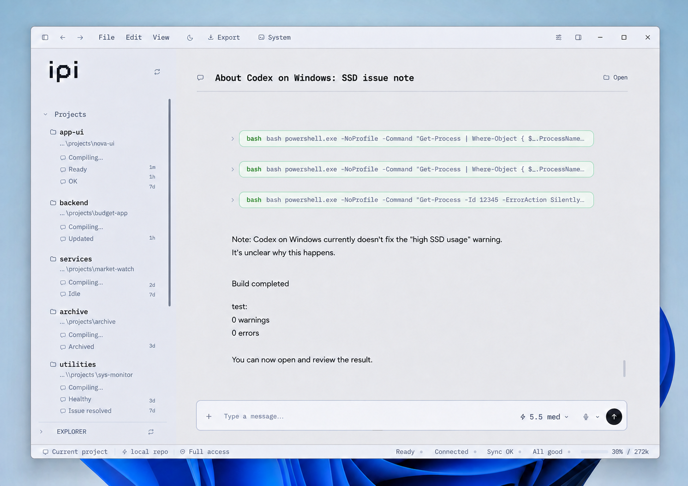
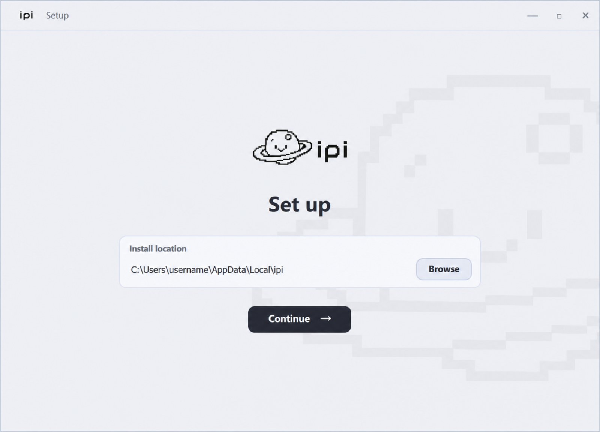
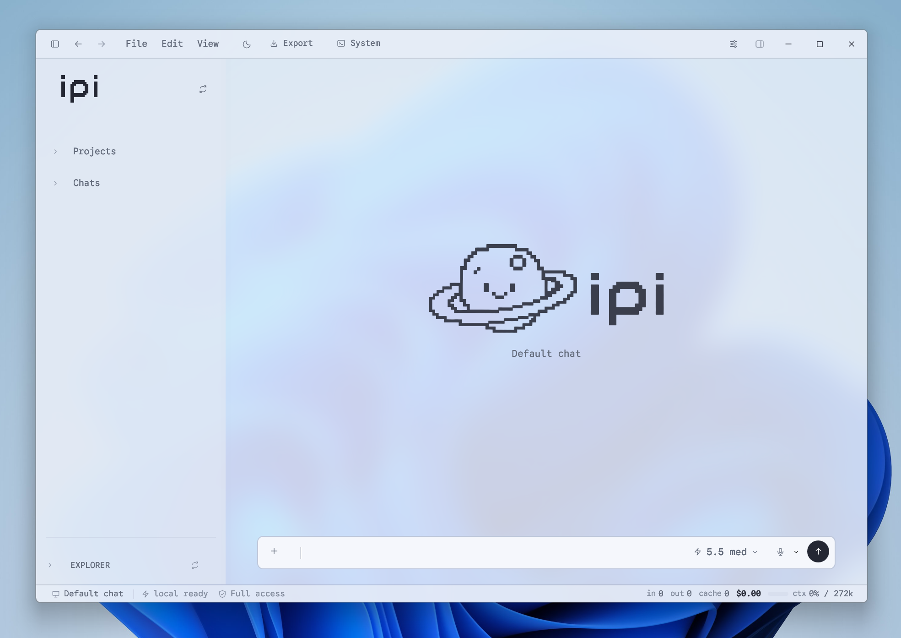
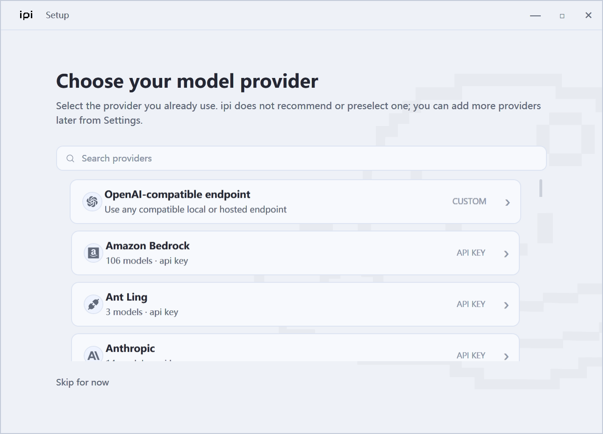
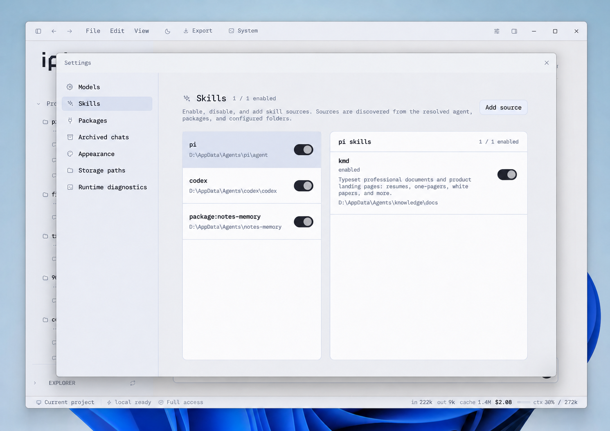

  

  <strong>A clean, fast native desktop foundation for local agent work, starting with Pi.</strong>

  
  
  
  
  

  <a href="#why-ipi">Why ipi</a>
  · <a href="#install">Install</a>
  · <a href="#runtime">Runtime</a>
  · <a href="#principles">Principles</a>
  · <a href="#platforms">Platforms</a>

---

**ipi** is an independent, unofficial native Windows desktop app for local agent workflows, starting with [Pi](https://pi.dev).

Pi is a clean, CLI-first local agent runtime: minimal, flexible, and easy to reason about. ipi keeps that spirit, but gives local agent work a real desktop surface: projects, sessions, model settings, approvals, skills, package management, diagnostics, and side chats in one quiet Windows app.

No browser tab. No Electron shell. No terminal-only workflow. No global Pi install required.

  

## Why ipi

Local agent tools should feel like software you can keep open all day.

They should start quickly, stay light, show what they are doing, and let the human stay in control. For developer work, raw model intelligence is not enough. The interface matters because the agent is reading files, editing code, running commands, and touching your workspace.

ipi is built around a simple belief:

> A good local agent should be powerful, but restrained.

Pi already has the right core: a clean local agent runtime, useful tools, provider flexibility, and very little unnecessary surface area. ipi adds the missing native Windows layer around it.

The result is a desktop agent system that is:

- **fast to open** — a native app, not a heavy browser workspace;
- **quiet by default** — no noisy dashboard chrome or fake productivity UI;
- **human-controlled** — tool calls, approvals, runtime state, and package actions stay visible;
- **provider-flexible** — use the model/provider setup you actually want;
- **local-first** — sessions, settings, runtime config, and workspace state stay on your machine;
- **Pi-compatible** — ipi uses the upstream Pi package instead of forking or repackaging it.

## Install

Download the latest beta from **Releases**:

- `ipi-Setup-...-win-x64.exe` — Windows installer
- `ipi-portable-...-win-x64.zip` — portable zip

The Windows builds are self-contained, so you do **not** need to install the .NET Desktop Runtime separately.

> Current beta builds are unsigned. Windows may show an **Unknown Publisher** / SmartScreen warning. Verify the SHA256 checksums in the release notes before running the installer.

## Runtime

ipi can use an existing local Pi runtime. If it cannot find one, first-run setup can initialize an ipi-managed runtime after confirmation.

Setup can:

1. show what will be downloaded or installed before anything happens;
2. download portable Node.js from `nodejs.org` when needed;
3. verify the Node archive against Node's official checksum file;
4. install the upstream `@earendil-works/pi-coding-agent` package from npm;
5. create local agent folders and open provider/model onboarding.

It does **not** install Pi globally, modify PATH, require admin rights, or store API keys.

  

  

Advanced runtime configuration is available from Settings and documented in [`docs/RUNTIME_BUNDLING.md`](docs/RUNTIME_BUNDLING.md).

## What it gives you

ipi focuses on the parts of local agent work that benefit from being visible and native:

- project and session navigation;
- clean, simple local chat connected to your configured agent runtime;
- provider setup for Codex OAuth authentication, Anthropic/Claude, common API-key providers, and OpenAI-compatible endpoints;
- inline tool approval;
- skills and package management;
- archived conversations;
- runtime diagnostics;
- temporary side chats for quick parallel questions;
- a clean, simple desktop interface.

  

Skills can be discovered from Pi, Codex, Claude Code-style folders, package folders, other local agent folders, and custom local paths, then enabled per source or per skill.

  

## Principles

ipi aims to become the cleanest, simplest desktop app foundation for local agent work.

For local agent work, the best interface is usually the one that stays out of the way until something important happens. ipi keeps the useful parts close and the noisy parts hidden, so local agents feel controllable instead of overwhelming.

Design rules:

- native desktop first; Windows beta first;
- fast startup and low overhead;
- no fake controls or decorative features;
- no provider recommendation by default;
- no plaintext API keys in project files;
- no silent global installs;
- no hidden package updates/removals;
- approvals happen when tools are actually requested;
- settings and diagnostics show real local state.

## Safety

ipi is local-first by design.

- It does not intentionally upload workspaces, sessions, settings, or secrets by itself.
- It avoids reading common secret files as normal text previews.
- Setup and package actions that can download, update, or remove code require confirmation.
- Plugin/package installs can execute third-party code through the package ecosystem; review sources before installing.
- ipi is independent and unofficial. It is not affiliated with or endorsed by Pi, Codex, Claude Code, OpenAI, Anthropic, Google, or model providers.

## Platforms

ipi is currently available as a Windows beta.

Planned next:

- macOS desktop build;
- Linux desktop build;
- stronger runtime repair and update flows;
- signed Windows builds when the product identity is ready.

The long-term goal is a clean desktop agent foundation across local developer machines, with Pi as the first runtime it supports deeply.

## Status

ipi is in beta. The core desktop app, Pi runtime integration, first-run setup, provider setup, skills, package management, diagnostics, installer, and portable packaging are active.

See [`docs/BETA_RELEASE.md`](docs/BETA_RELEASE.md) for current beta notes and known limitations.

## License

MIT © 2026 Vex
